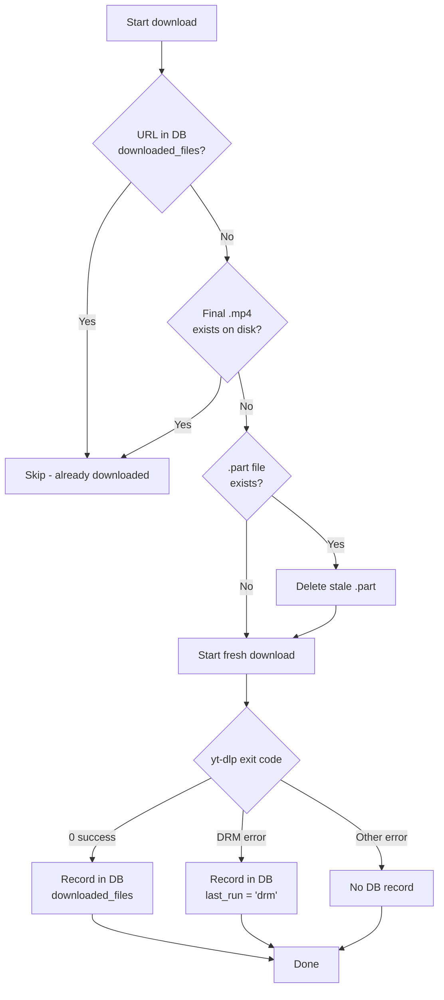

# thuis -- VRT MAX downloader (proof of concept)

A simple tool to download videos from VRT MAX using yt-dlp. It wraps yt-dlp with the right settings and credentials so you can start downloading with minimal setup.

This is a proof of concept. It works for basic use cases but comes with no guarantees.

## Requirements

- Python 3.8 or newer
- git
- A VRT MAX account (free or paid)

## Installation

Open a terminal and run these commands:

```bash
# Clone the repository
git clone <repository-url> thuis
cd thuis

# Create a virtual environment with uv (recommended, uses hardlink mode for disk efficiency)
uv venv --link-mode=hardlink

# Install dependencies with uv
uv pip install -r requirements.txt --python .venv/bin/python
```

This installs a patched version of yt-dlp that can handle VRT MAX's login flow.

## Usage

### Option 1: Wrapper scripts (easiest)

Linux:

```bash
./thuis.sh https://www.vrt.be/vrtmax/a/show/...
```

Windows:

```cmd
thuis.bat https://www.vrt.be/vrtmax/a/show/...
```

### Option 2: Direct Python

If you prefer calling the Python module directly (or the wrapper scripts are not working):

```bash
python -m thuis.main https://www.vrt.be/vrtmax/a/show/...
```

Or from the project root:

```bash
python src/thuis/main.py https://www.vrt.be/vrtmax/a/show/...
```

### Option 3: Watchlist Mode (for automated processing)

Process multiple URLs from text files with scheduling support. Each series has its own watchlist file.

```bash
# Process a single series watchlist (dry run to see what would be downloaded)
./thuis.sh --watchlist watchlists/series_a.txt --dry-run

# Process manual entries for a series (requires --now)
./thuis.sh --watchlist watchlists/series_a.txt --now

# Process multiple series at once (all require --now for manual entries)
./thuis.sh --watchlist watchlists/series_a.txt \
           --watchlist watchlists/series_b.txt \
           --watchlist watchlists/series_c.txt \
           --watchlist watchlists/series_d.txt \
           --now --dry-run

# Process podcasts (scheduled entries run automatically, manual need --now)
./thuis.sh --watchlist watchlists/podcasts.txt --now --dry-run
```

#### Watchlist File Format

1. **First non-comment line**: Output directory (where files will be saved)
   - Supports absolute paths, relative paths, and `~/` home expansion
   - TV series example: `/path/to/tv/shows/`
   - Podcasts example: `/path/to/podcasts/`

2. **Subsequent lines**: URL entries
   - No schedule = manual entries requiring `--now` flag to run
   - Scheduled entries: `[daily]`, `[weekly]`, `[weekdays 10:00]`, etc.

#### Example Watchlist Files

Example watchlist files are provided in the `watchlists/` directory for different types of content (TV shows, podcasts, etc.).

TV series watchlists typically point to a TV shows directory.
Podcast watchlist points to a podcasts directory.

## Examples

### Download a single video

```bash
./thuis.sh https://www.vrt.be/vrtmax/a/show/...
```

### Download multiple videos at once

```bash
./thuis.sh https://www.vrt.be/vrtmax/a/show/1/ https://www.vrt.be/vrtmax/a/show/2/ https://www.vrt.be/vrtmax/a/show/3/
```

### Download videos from a URL file

Create a text file with one URL per line (blank lines and lines starting with `#` are ignored):

```
# my-list.txt
https://www.vrt.be/vrtmax/a/show/1/
https://www.vrt.be/vrtmax/a/show/2/
```

Then run:

```bash
./thuis.sh --file my-list.txt
```

### Dry run (see what would be downloaded)

```bash
./thuis.sh --dry-run https://www.vrt.be/vrtmax/a/show/...
```

### Custom output directory

```bash
./thuis.sh --output-dir ~/Videos https://www.vrt.be/vrtmax/a/show/...
```

### Video resolution profile

```bash
./thuis.sh --profile 720 https://www.vrt.be/vrtmax/a/show/...
```

Limits the video resolution to a specific value (e.g. 720, 1080). The tool selects the best available stream at or below that resolution.

```bash
./thuis.sh -p 1080 https://www.vrt.be/vrtmax/a/show/...
```

The short form `-p` works the same way.

### Retry mode

```bash
./thuis.sh --retry https://www.vrt.be/vrtmax/a/show/...
```

Skips URLs whose output file already exists. Useful for resuming an interrupted batch without re-downloading files that already finished.

### Normalize video filenames

Renames downloaded video files to a scene-compatible format and optionally cleans up leftover files.

```bash
python -m thuis.main normalize /path/to/media --dry-run
python -m thuis.main normalize /path/to/media --cleanup
```

Options:

- `--dry-run` -- Show what would be renamed without making changes.
- `--cleanup` -- Remove duplicate files (with `_1` suffixes) and stale `.part` files.

The `normalize` subcommand runs separately from downloads. Point it at a directory of already-downloaded files.

### Download a full season

Pass a season URL to download every episode in that season:

```bash
# By season number in path
./thuis.sh https://www.vrt.be/vrtmax/a-z/your-show/2/

# By query parameter
./thuis.sh 'https://www.vrt.be/vrtmax/a-z/your-show/?seizoen=seizoen-2'
```

The tool expands the season URL to individual episode URLs by querying the VRT MAX GraphQL API, falling back to HEAD-request guessing if the API returns no results. Combine with `--dry-run` to preview what would be downloaded:

```bash
./thuis.sh --dry-run 'https://www.vrt.be/vrtmax/a-z/your-show/?seizoen=seizoen-2'
```

Limit the number of episodes processed per season with `--max-episodes`:

```bash
# Download only the first 5 episodes of a season
./thuis.sh --max-episodes 5 https://www.vrt.be/vrtmax/a-z/your-show/2/
```

### Download all seasons of a show

Pass a bare show URL (without a season number) to automatically discover and download every season:

```bash
./thuis.sh https://www.vrt.be/vrtmax/a-z/your-show
```

The tool queries the show page, detects all available seasons, and expands each into its episodes. Combine with `--dry-run` to preview:

```bash
./thuis.sh --dry-run https://www.vrt.be/vrtmax/a-z/your-show
```

Limit episodes per season with `--max-episodes`:

```bash
# Download at most 10 episodes per season, across all seasons
./thuis.sh --max-episodes 10 https://www.vrt.be/vrtmax/a-z/your-show
```

## Credentials

The tool uses default credentials out of the box. You do not need to set up anything to get started.

If you want to use your own VRT MAX account, set these environment variables:

```bash
export VRT_EMAIL="your-email@example.com"
export VRT_PASSWORD="your-password"
```

You can also add them to a `.env` file in the project root:

```
VRT_EMAIL=your-email@example.com
VRT_PASSWORD=your-password
```

The tool checks environment variables first, then the `.env` file (if python-dotenv is installed), and falls back to the built-in defaults.

## Output

Videos are saved in the `media/` directory by default. Each file is named after the video title. You can change this with `--output-dir`.

Logs are written to `logs/` in date-based files (e.g. `logs/2026-07-07.log`). Use `--log-level` to control verbosity (e.g. `--log-level DEBUG` for detailed output).

To tail the current log in real-time:

```bash
./thuis.sh --follow
# or
./thuis.sh -f
```

## Transcoding to 720p

After downloading, you can transcode videos to a target resolution (e.g. 720p). This is useful for:

- Reducing file size for storage or streaming
- Ensuring consistent resolution across your library
- Upscaling lower-resolution downloads

### Transcode during download

Use `--transcode` to automatically transcode files after download:

```bash
./thuis.sh --transcode 720p https://www.vrt.be/vrtmax/a/z/your-show/1/
```

Options:

- `--transcode TARGET` - Target resolution (e.g., `720p`, `1080p`). Files already at this resolution are skipped.
- `--allow-upscale` - Allow upscaling lower resolutions (e.g., 540p → 720p).
- `--keep-original` - Keep both original and transcoded files.
- `--transcode-preset PRESET` - FFmpeg preset: `fast` (default), `medium`, `slow`, etc.
- `--transcode-crf CRF` - Quality setting (0-51, lower = better quality, default: 23).

**Smart source selection**: If multiple resolutions exist (e.g., 1080p and 540p), the highest available is used for transcoding (1080p → 720p is preferred over 540p → 720p).

### Batch transcode existing files

Use `--input-dir` to transcode files without downloading:

```bash
# Transcode your-show files to 720p
python -m thuis.main --input-dir /path/to/media/tv/seed/ \
    --transcode 720p \
    --filter "your-show" \
    --allow-upscale \
    --keep-original \
    --recursive \
    --parallel 2

# Preview without transcoding
python -m thuis.main --input-dir /path/to/media/tv/seed/ \
    --transcode 720p \
    --filter "your-show" \
    --recursive \
    --dry-run
```

Options:

- `--input-dir DIR` - Directory containing video files to transcode.
- `--filter PATTERN` - Filter files by name (substring match, case-insensitive). Can be used multiple times.
- `--recursive` - Scan subdirectories recursively.
- `--parallel N` - Number of concurrent transcoding jobs (default: 2).

### Examples

```bash
# Transcode all downloaded your-show episodes to 720p, keep originals
python -m thuis.main --input-dir ~/media/tv/seed/ \
    --transcode 720p \
    --filter "your-show" \
    --allow-upscale \
    --keep-original \
    --recursive

# Transcode a single show with higher quality (CRF 18 = larger file, better quality)
python -m thuis.main --input-dir ~/media/tv/ \
    --transcode 720p \
    --filter "your-show" \
    --transcode-crf 18 \
    --transcode-preset medium

# Batch transcode with dry-run first
python -m thuis.main --input-dir ~/media/ \
    --transcode 720p \
    --recursive \
    --dry-run
```

## Interrupt handling

- Pressing Ctrl + C now exits cleanly with "Interrupted by user" and no traceback.

## Resume & Partial File Handling

The tool automatically handles interrupted or failed downloads — just re-run the same command. No manual cleanup required.



### Behavior Summary

| Scenario | On re-run |
|----------|-----------|
| Network error / Ctrl+C | Stale `.part` auto-deleted, download restarts |
| DRM protected | Marked `drm` in DB, skipped unless `--now` |
| Complete file exists | Skipped (DB or filesystem check) |
| Partial `.part` only | Auto-deleted, download restarts |

**Key points:**
- Only **successful** downloads (`returncode == 0`) are recorded in `downloaded_files`
- Failed/partial downloads are **not** recorded, so re-running picks them up
- `check_file_exists()` in `watchlist.py` removes orphaned `.part` files automatically
- DRM failures persist in `last_run` table; use `--now` to retry

[Contributing Guidelines](CONTRIBUTING.md)

Website documentation: `website/docs/`

## How it works

The tool finds the patched yt-dlp binary, passes it your VRT MAX URLs along with the right settings (best video + audio, merged to MP4), and lets yt-dlp handle the actual download. It uses your VRT MAX credentials to log in so the videos are accessible.

## DRM Quick Start

Some VRT MAX content uses Widevine DRM. To enable decryption:

1. **Install a decryption engine** — one of: `N_m3u8DL-RE` (recommended), `mp4decrypt` (Bento4), or `shaka-packager`
2. **Provide a `.wvd` file** — place your Widevine CDM file at `~/.thuis/wvd/device.wvd` (or set `WVD_CDM_PATH` in `.env`)
3. **Enable in `.env`** — `DECRYPT_DRM=yes` (default)

Extract your CDM: `python scripts/extract_cdm.py`

Full details: see `docs/REQUIREMENTS.md`

## Doctor Command

Diagnose DRM pipeline readiness and auto-fix issues:

```bash
# Check status
./thuis.sh doctor

# Auto-fix installable issues (apt/brew/scoop, .env)
./thuis.sh doctor --fix

# Show help
./thuis.sh doctor --help
```

The doctor command checks:

- Python dependencies (yt-dlp, pywidevine, pymp4)
- Decryption engines (mp4decrypt, shaka-packager, ffmpeg)
- N_m3u8DL-RE binary
- Widevine CDM (.wvd file)
- Environment variables (DECRYPT_DRM, WVD_CDM_PATH)
- .env file configuration

Run `./thuis.sh doctor` whenever DRM downloads fail to see what's missing.

## Disclaimer

This is a proof of concept. It may break if VRT MAX changes their website or login flow. The default credentials are shared demo credentials. Respect VRT's terms of service.
